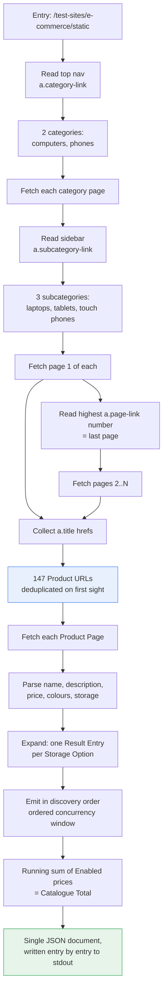

# Crawl methodology and selectors

How the scraper walks the site and which selectors it depends on. Recorded because these
selectors are the program's entire contract with a site we do not control: when the
scrape breaks, this is the page that says what we assumed.

## The walk

### Why the walk takes two hops to reach the subcategories

The sidebar is contextual: it lists the subcategories of the category you are currently
in, and nothing else. Fetching the three navigation pages shows the whole of it:

| Page | `a.category-link` | `a.subcategory-link` |
|---|---|---|
| `/static` | computers, phones | **none** |
| `/static/computers` | computers, phones | laptops, tablets |
| `/static/phones` | computers, phones | touch |

So the subcategories cannot be read from the entry page — the selector matches nothing
there. The categories are read first, then each category page is fetched for its sidebar.

Those two extra requests are for **navigation only**. The entry page and the category
pages each render three featured Products picked at random per request — we confirmed the
same URL returns different Products on successive fetches — so reading Product data from
them would make output nondeterministic, violating
[ADR-0012](./0012-deterministic-discovery-order.md). Their nav markup is stable; only the
Product cards move. Every one of the 147 Products is reachable through the three
subcategories, so ignoring those cards loses nothing.

Pagination is read rather than probed: page 1 always links the last page (`?page=20` for
laptops, `?page=4` for tablets, `?page=2` for touch phones), so page count is known after
one request instead of by fetching until a 404.

That totals 176 requests: 1 entry, 2 category pages, 26 Category Pages, 147 Product Pages.

Every arrow in that diagram is a stream, not a list: no stage collects what the stage
above it produced, so the 147 Product URLs are never all resident and neither are the 561
Result Entries they expand into. That is
[ADR-0017](./0017-stream-the-catalogue-rather-than-assemble-it.md)'s business, not this
record's — the walk it describes is unchanged, and so is the request count.

## Selectors

Verified against the four committed fixtures and, for the navigation pages the fixtures do
not cover, against the live site. Every one of these is an assumption that can break.

### Navigation pages (entry, `/computers`, `/phones`)

| Purpose | Selector | Read | Notes |
|---|---|---|---|
| Categories | `a.category-link` | `href` | Present on every page; read from the entry page. |
| Subcategories | `a.subcategory-link` | `href` | **Only the current category's.** Absent on the entry page. |

### Category Page

| Purpose | Selector | Read |
|---|---|---|
| Product links | `a.title` | `href` |
| Pagination | `a.page-link` | `href`, highest `?page=` wins |

### Product Page

| Purpose | Selector | Read | Absent when |
|---|---|---|---|
| Name | `h4.title[itemprop="name"]` | text | never |
| Description | `p.description[itemprop="description"]` | text | never |
| Price | `[itemprop="price"]` | text, `$1170.1` → `117010` cents | never |
| Colour Options | `select[aria-label="color"] option` | `value`, empty placeholder dropped | Product has no colours |
| Storage Options | `.swatches button.swatch` | `value` | Product has no storage |
| Enabled | `.swatches button.swatch[disabled]` | presence ⇒ `enabled: false` | — |

The three fixture shapes exist precisely to cover the "absent when" column: laptop
(storage, no colours), tablet (both), phone (colours, no storage).

## Consequences

`a.subcategory-link` being contextual is the sharp edge here. It reads like a site-wide
menu and is not one, and the failure mode is silent: point the crawl at the entry page
with the one-hop walk and it finds zero Products and emits a valid, empty, wrong
document. The fixtures do not catch it — none of them is a navigation page — so it is
written down instead.

`[itemprop="price"]` is unique on a Product Page but appears once per card on a Category
Page — one more reason [ADR-0013](./0013-product-page-is-the-sole-data-source.md) reads
prices from Product Pages only.

Robots is respected by inspection rather than by a parser: `robots.txt` disallows
`/test-sites/product/`, `/test-sites/pagination*`, `/test-sites/scroll/` and
`/test-sites/load-more/`. Our paths are all under `/test-sites/e-commerce/static/`, which
no rule prefixes, so the crawl is permitted. If the crawl is ever pointed elsewhere, that
conclusion has to be re-checked by hand.
