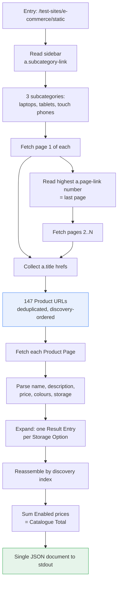

# Crawl methodology and selectors

How the scraper walks the site and which selectors it depends on. Recorded because these
selectors are the program's entire contract with a site we do not control: when the
scrape breaks, this is the page that says what we assumed.

## The walk

Category landing pages (`/computers`, `/phones`) and the entry page are **not** scraped
for data. Each renders three featured Products picked at random per request — we confirmed
the same URL returns different Products on successive fetches — so reading them would make
output nondeterministic, violating
[ADR-0012](./0012-deterministic-discovery-order.md). Every one of the 147 Products is
reachable through the three subcategories, so nothing is lost by ignoring them.

Pagination is read rather than probed: page 1 always links the last page (`?page=20` for
laptops), so page count is known after one request instead of by fetching until a 404.

## Selectors

Verified against the four committed fixtures. Every one of these is an assumption that can
break.

### Category Page

| Purpose | Selector | Read |
|---|---|---|
| Subcategories | `a.subcategory-link` | `href` |
| Product links | `a.title` | `href` |
| Pagination | `a.page-link` | `href`, highest `?page=` wins |

### Product Page

| Purpose | Selector | Read | Absent when |
|---|---|---|---|
| Name | `h4.title[itemprop="name"]` | text | never |
| Description | `p.description[itemprop="description"]` | text | never |
| Price | `[itemprop="price"]` | text, `$1170.1` → `117010` cents | never |
| Colour Options | `select[aria-label="color"] option` | `value`, empty placeholder dropped | Product has no colours |
| Storage Options | `.swatches button.swatch` | `value` | Product has no storage |
| Enabled | `.swatches button.swatch[disabled]` | presence ⇒ `enabled: false` | — |

The three fixture shapes exist precisely to cover the "absent when" column: laptop
(storage, no colours), tablet (both), phone (colours, no storage).

## Consequences

`[itemprop="price"]` is unique on a Product Page but appears once per card on a Category
Page — one more reason [ADR-0013](./0013-product-page-is-the-sole-data-source.md) reads
prices from Product Pages only.

Robots is respected by inspection rather than by a parser: `robots.txt` disallows
`/test-sites/product/`, `/test-sites/pagination*`, `/test-sites/scroll/` and
`/test-sites/load-more/`. Our paths are all under `/test-sites/e-commerce/static/`, which
no rule prefixes, so the crawl is permitted. If the crawl is ever pointed elsewhere, that
conclusion has to be re-checked by hand.
